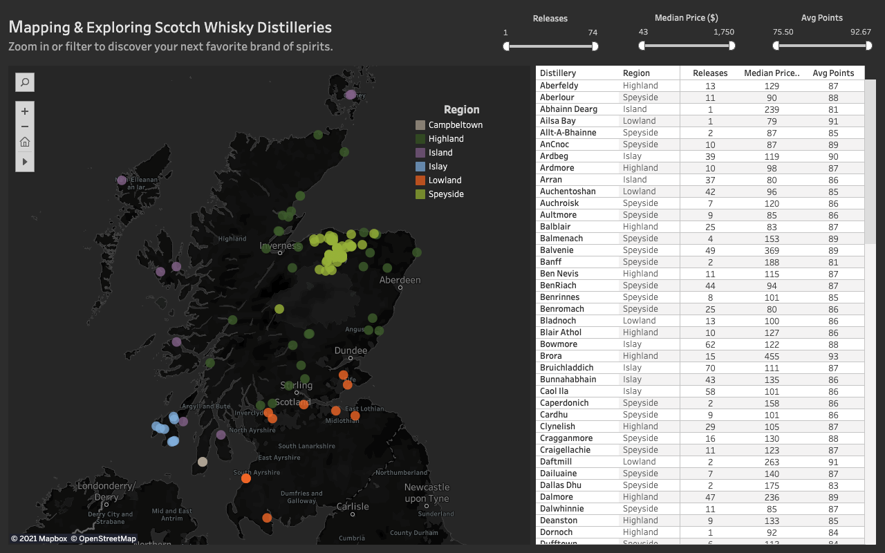

```{r setup, include=FALSE}
knitr::opts_chunk$set(echo = TRUE, warning = FALSE, message = FALSE, 
                      results = "show", cache = FALSE, autodep = FALSE)
knitr::opts_knit$set(root.dir = "external/whisky")
```

```{r, include=FALSE}
here::i_am("analysis/scotch-analysis-part3.R")
source(here::here("analysis", "scotch-analysis-part3.R"))
```

# Part 3: Mapping Distilleries & Regions
Welcome to the next installment of **Exploring Whisky: The Journey to My Next Bottle of Scotch**, a multi-part project in which I leverage data to share fun facts about whisky as I continue my hopeful search to discover delicious scotch. 

Previously in [Part 1](https://www.google.com/), we built our dataset from scratch by scraping scotch whisky reviews, prices, brands, regional locations, and more from [Whisky Advocate](https://www.whiskyadvocate.com/ratings-and-reviews/), Wikipedia ([1](https://en.wikipedia.org/wiki/List_of_whisky_distilleries_in_Scotland), [2](https://en.wikipedia.org/wiki/Category:Distilleries_in_Scotland), [3](https://en.wikipedia.org/wiki/Category:Blended_Scotch_whisky)), and [whisky.com](https://www.whisky.com/whisky-database/database.html). Then in [Part 2](https://www.google.com/), we explored the distributions of and relationships between variables including whisky `type`, `age`, `ABV`, `price`, and rating `points`.

Next, [Part 3](https://github.com/bengreenwald/whisky/blob/main/analysis/scotch-analysis-part3.R) takes a closer look at whisky brands and where distilleries are located across the six different scotch regions of Scotland.

# Project Goals
As a reminder, the overarching goals of this mutli-part project are threefold:

* To augment my learning about whisky brands, regions, flavors, and options
* To understand the breadth, depth, and quirks of the scotch whisky industry
* To leverage data to determine which whiskies I ought to try myself

# Mapping Distilleries & Regions
What makes each scotch unique depends heavily on regional location throughout Scotland. In Part 3, we take the first step towards understanding the regionality of whisky by exploring differences across brands (`distillery`) and `region`. Plus, we can make use of `lat` and `long` coordinates to create an interactive map of distilleries across Scotland to observe geographical clustering.

```{r, echo=FALSE}
scotch %>% 
  select(whisky, distillery, region, lat, long) %>% 
  glimpse()
```

## Guiding Questions
* Which regions release the most whiskies?
* Which regions produce the most highly-rated whiskies?
* Which brands release the most expensive and/or highly-rated whiskies?
* Which brands are the most prolific?
* How clustered or distributed are distilleries across Scotland?

## Regions
*Which regions release the most whiskies?*
*Which regions produce the most highly-rated whiskies?*

[Scotch whisky regions are not exactly standardized](https://www.whiskyadvocate.com/scotch-regions-list/) or commonly recognized across the industry, but many consider there to be six different regions: Speyside, Highland, Lowland, Islay, Islands, and Campbeltown. Each `region` boasts a distinct whisky style and sensibility. In future installments of this project, we'll explore how flavor profiles vary between regions and distilleries within them. For now, let's check out a regional breakdown of the whisky releases in our data.

```{r, echo=FALSE}
region_treemap
```

Where regional information was available, a significant proportion of the whiskies included originate from the Speyside and Highland regions, followed by the Islay region to a lesser extent. This [treemap plot](https://wilkox.org/treemapify/index.html) demonstrates just how prolific brands such are Highland Park, Bruichladdich, and Macallan are, each rivaling the number of releases coming from the entire Lowland or Campbeltown regions alone.

Volume is one thing, but what about quality? This violin plot illustrates the distribution of whisky release rating `points` segmented by region and sorted by each region's highest-rated scotch. As a reminder, Whisky Advocate uses a tiered, 100-point [rating scale](https://www.whiskyadvocate.com/ratings-and-reviews/) as described below: 

* 95-100 points — **Classic**: *a great whisky*
* 90-94 points — **Outstanding**: *a whisky of superior character and style*
* 85-89 points — **Very Good**: *a whisky with special qualities*
* 80-84 points — **Good**: *a solid, well-made whisky*
* 75-79 points - **Mediocre**: *a drinkable whisky that may have minor flaws*
* 50-74 points - **Not Recommended**

```{r, echo=FALSE}
region_violin
```

In general, Islay whiskies appear to slightly edge out Speyside and Highland whiskies when it comes to quality. Anecdotally, I've always felt that whiskies from the Islay region, which are known for their peatiness, carry a favorable reputation amongst scotch connoisseurs. [Peated whisky](https://en.wikipedia.org/wiki/Peat#Scotland) is created by harvesting local earthy moss and burning it to dry the malted barley before the distillation process begins, which infuses the whisky with a distinct smoky flavor. The peated earths nearby each distillery have their own quirks and qualities, thereby resulting in unique smoky flavor notes across different scotch. I myself typically favor sherried, fruity Speyside whiskies over the smoky notes of an Islay, but I'd love to develop more of a taste for peaty whiskies, and perhaps that's where this project will lead.

Rating points across Lowland whiskies vary fairly little, but the region certainly appears a tier below its peers in quality. My sense (from the internet) is that Lowland whiskies are more delicate with less audacious flavors than other regional varieties, and while their mildness works well for scotch beginners, it is perhaps slightly too ho-hum for experts. In contrast, Speyside, Highland, and Island whiskies vary widely in quality. Recalling some of the lowest scoring whiskies from [Part 2](https://bengreenwald.io/project/exploring-whisky-scotch-part2/#points) helps to explain the long negative tails of these regional distributions. 

## Distilleries & Brands
*Which brands release the most expensive and/or highly-rated whiskies?*
*Which brands are the most profilic?*

So far, we've learned that Highland, Speyside, and Islay regions are generally home to the most prolific brands and the highest-rated scotch, with a few exceptions. But affordability matters too, and I'd like to know which brands are the best bang for my buck. 

Let's roll `price`, `points`, `region`, `distillery`, and releases into a single bubble plot by comparing each brand's median release price to its average rating across those releases. Because we know from [Part 2](https://bengreenwald.io/project/exploring-whisky-scotch-part2/#price) that `price` is heavily skewed due to exorbitantly lavish price points, we can use the median here as a more stable and skew-resistant statistic compared to the mean. I also noticed that Ladyburn's lone release in the data was priced at a hefty $1,750 (at least 3x larger than the next higher median price). With that in mind, I omitted Ladyburn as an extreme outlier here to create a more legible plot.
<br>
```{r, echo=FALSE}
shiny::div(brand_plotly, align = "center")
```
<br>
Observing distilleries across all regions together, most brands cluster together between a median price of \$50-200 and an average rating points of 84-90, indicating again that there are plenty of affordable "Very Good" scotches out there to explore. Hooray! Some brands notably outside of the cluster that struck my interest include: 

* **Knockando**, a Speyside brand with only 2 releases, but a dreadfully low average rating
* **Balvenie**, a highly prolific Speyside distillery with expensive, well-rated scotch
* **Glenfarclas**, a pricey Speyside brand with over 30 releases and a median price over \$500
* **Brora**, a well-regarded premium Highland brand with a stunning average rating of 92.7 points across 15 releases
* **Ailsa Bay**, a fascinating new Lowland distillery with only one experimental, cheap, and extremely well-rated scotch

Further can be gleaned from isolating particular regions across Scotland using [Plotly](https://plotly.com/r/)'s interactive toggling feature. The plot is unsurprisingly dominated by entries from the Speyside and Highland regions, from where my [benchmark scotch](https://bengreenwald.io/project/exploring-whisky-scotch-part2/#benchmark-scotch-whiskies) brands Glenfiddich and Glengoyne originate respectively. Filtering out other brands makes either region's most prolific, reasonably-priced brands (Glenlivet, Macallan, Glenmorangie) easier to locate. Generally, Speyside distilleries seem to skew a bit more expensive than Highland brands.

The remaining four regions (Islay, Island, Lowland, and Campbeltown) only have a few entries each. Islay is a remarkably consistent region with 8 distilleries includes, each of which have at least 30 releases, median prices between \$90-$130, and average ratings between 86-91 points. There may not be many square acres of land in the Islay region, but every distillery is fairly prolific and very well-regarded, including Lagavulin (the scotch famously enjoyed by Parks & Recreation's [Ron Swanson](https://www.youtube.com/watch?v=frbsZ8TGsX8) and real life's [Nick Offerman](https://www.youtube.com/watch?v=jNOye7_9qag), who happen to be the same person.)

<figure>
  
</figure>

The most prolific brands in the Lowlands region such as Auchentoshan and Bladnoch are tightly clustered around 85 average points and a \$100 median price, while other boutique brands such as Daftmill, Ailsa Bay, and Leven have 1-2 releases each at the extremes of price and rating. In the Islands region, we can easily find the extremely prolific Highland Park (located way up on the Orkney Islands and by far the most northern distillery), but Abhainn Dearg also stands out from the pack with one whisky release that is far more expensive (\$239) than its rating of 81 would suggest. Lastly, the once bustling scotch region of Campbeltown is now typically forgotten; led by Springbank, the Campbeltown region only has three remaining brands to carry forward its history after several misguided distillers opted to cut corners and peddle mass-produced, subpar scotch for a few decades, leading to the majority of distilleries getting shuttered nearly a century ago. 

It's also worth acknowledging that several notable brands in these data aren't associated with a specific region on [whisky.com](https://www.whisky.com/whisky-database/database.html) (see the No Region group). Some are [independent bottlers](https://en.wikipedia.org/wiki/Independent_bottler) (Adelphi, Ballantine's, Gordon & MacPhail) that create partnerships with distilleries and release niche versions of their scotch under different branding. Others are well-known blended whisky brands that don't have a brick and mortar distillery of their own, but rather they share facilities with single malt distillers (Johnnie Walker & Cardhu, Dewar's & Aberfeldy, Chivas Regal & Strathisla, and the list goes on). While these brands are very lucrative businesses that might invite consumers to their swanky liquor shops or experiential visitor centers, they don't inherently carry the same authentic regionality as single malt scotches, regardless of where they physically produce their whisky.

## Interactive Map
*How clustered or distributed are distilleries across Scotland?*

We have a sense of which regions collectively produce the most whisky (Speyside, Highland) and which produce the best whisky according to Whisky Advocate (Islay, followed by Speyside and Highland). However, it's difficult to fully grasp these findings without layering distilleries locations over a map of Scotland to better grasp the geographical spread within and across regions. It's time to make use of our `lat` and `long` coordinate variables, which were scraped from whisky.com in [Part 1](https://github.com/bengreenwald/whisky/blob/main/code/scrape-scotch-distilleries.R). I believe that maps are best explored interactively, so let's send the data over to Tableau and build a simple interactive dashboard.

<figure>
  <a href="https://public.tableau.com/views/MappingScotchDistilleriesRegions/dash?:language=en&:display_count=y&publish=yes&:origin=viz_share_link" >
      
  </a>
  <figcaption>
      <body>*Click the image to explore the interactive dashboard.*</body>
  </figcaption>
</figure>

The first thing that jumps out from the map is how self-contained and densely populated the Speyside region is. No region produces more scotch, and yet Speyside is described as smaller than the size of Rhode Island. According to [scotchwhisky.com back in 2016](https://scotchwhisky.com/magazine/around-the-world/whisky-travel/10840/dufftown/), the charming parish of Dufftown alone produces over 40 million liters of spirit annually across its six distilleries. Because Speyside is so compact and home to many legendary distilleries such as Glenlivet, Glenfiddich, Macallan, Balvenie, and Glenfarclas, it has become a favorite for visitors who aspire to bounce between several distilleries in a single day. My wife and I made our own day-long pilgrimage from Inverness to the Speyside region to visit Glenfiddich and Aberlour during our honeymoon. My only regret was not spending more time in Speyside; it's beautiful, and the spirit flows endlessly. 

<figure>
      
  <figcaption>
      <body>*Walking along the River Spey, our bellies full of scotch.*</body>
  </figcaption>
</figure>

But the Speyside region is not isolated; in fact, it sits within the expansive Highland region, which in the world of scotch encompasses pretty much everything just north of Edinburgh and Glasgow on Scotland's primary land mass. Compared to Speyside, the spread here is much greater. Glengoyne, which sits directly upon the [Highland Line](https://en.wikipedia.org/wiki/Highland_Boundary_Fault) that separates the Highland and Lowland regions in Scotland, is over 250 miles away from Wolfburn and Pulteney distilleries, yet all three are considered technically part of the Highlands. Meanwhile, the Lowlands comprises a much smaller area just south of Scotland's largest metro areas. Most of its distilleries hover around Edinburgh or Glasgow, but one exception is Bladnoch, which is still in Scotland but further south than Newcastle in England. 

One interesting trend revealed by the map is that many distilleries seem to be located nearby the coastline. Perhaps that's why islands are such popular spots for distilling scotch, such as in the Islay, Campbeltown, and Islands regions. Whereas Islay and Campbeltown are self-contained islands that contain all of their regions' whisky, the Islands region is more of a catch-all expanse encompassing several islands all over Scotland including Skye, Arran, Jura, Orkney, and more. 

True to their coastal locales, scotch from these island regions tend to celebrate maritime flavors, with many whiskies tasting salty, briny, or even with notes of seaweed. Turns out that these flavors are often by design; many distillers deliberately expose their barrels to salty sea air for many years, which imbues the aging scotch inside with fascinating characteristics of the sea. This map also exemplifies how impressively the Islay region punches above its tiny size; it's incredible how so much of the world's highest rated whisky originates from a place smaller than New York City in land area.

# Conclusion
Some of the major takeaways from this analysis:

* The **Speyside region** is just the size of Rhode Island, yet it produces more scotch than any other region in Scotland. Meanwhile, the Highland region is by far the largest in land area, and together, **the Speyside and Highland regions account for nearly two thirds of whisky releases in our data** (*when regional data was available*).

* **The tiny Islay region produces the highest-rated scotch**. Each of its eight distilleries are prolific and well-regarded, and their whiskies are famously known for their distinct characteristics of smoke and peat.

* In these data, **Highland Park and Bruichladdich each produce an amount of whisky releases on par with all distilleries combined across either of the entire Lowlands or Campbeltown regions**, reinforcing that islands and coastlines are particular hotspots for scotch production.

* **Glenfarclas, Brora, and Balvenie are the most prolific, yet expensive distilleries** with median release prices soaring between \$360-\$540. However, **only Brora seems worth the extra cash**; it easily boasts the highest average rating for a distillery, while Glenfarclas and Balvenie are similarly rated to their peers that are priced 3-4x cheaper.

* **The vast majority of brands cluster together between a median price of \$50-200 and an average rating of 84-90 points**, suggesting once again that there are plenty of affordable, "Very Good" scotches out there to discover. I'm excited to try them! 

[Code for Part 3](https://github.com/bengreenwald/whisky/blob/main/analysis/scotch-analysis-part3.R) available on Github.

# Next Steps
We've dipped our toes into the regionality of scotch, and location seems to play a definitive role in a whisky's identity and flavor profile. Next, Part 4 will include a text analysis of Whisky Advocate review descriptions and qualitative feedback to determine whether we can parse out common flavors and themes across scotch releases to better understand the complexity and taste of whisky.